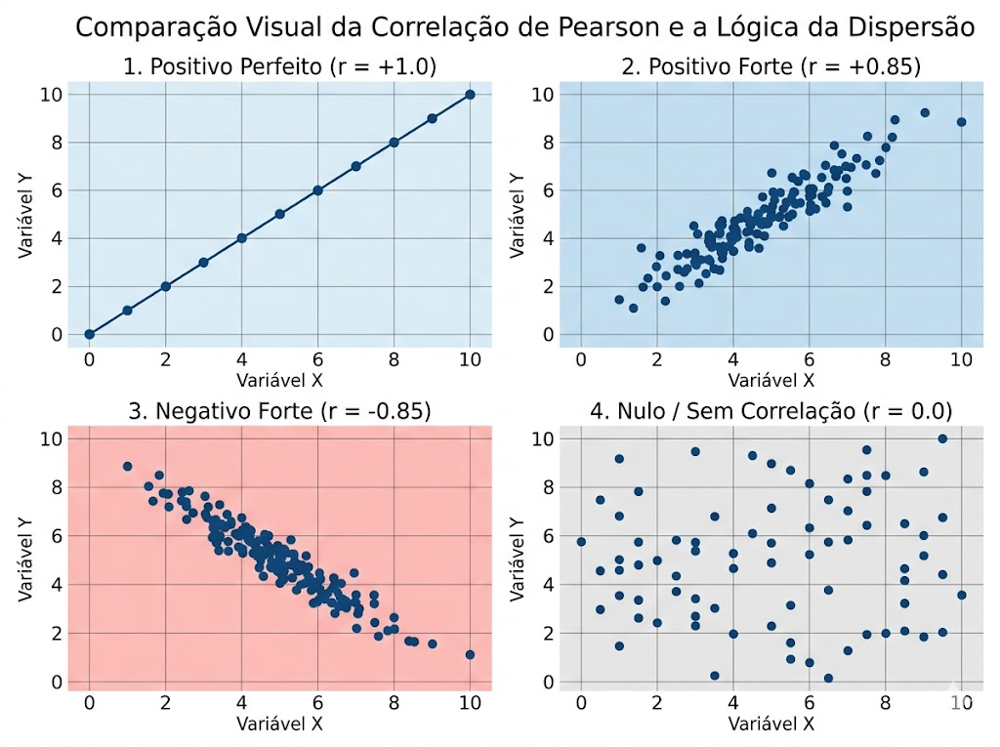
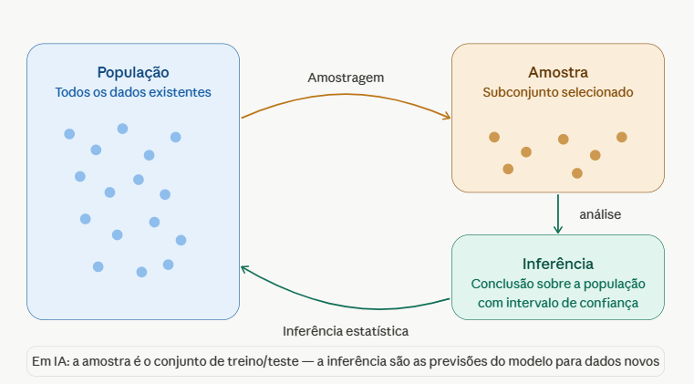
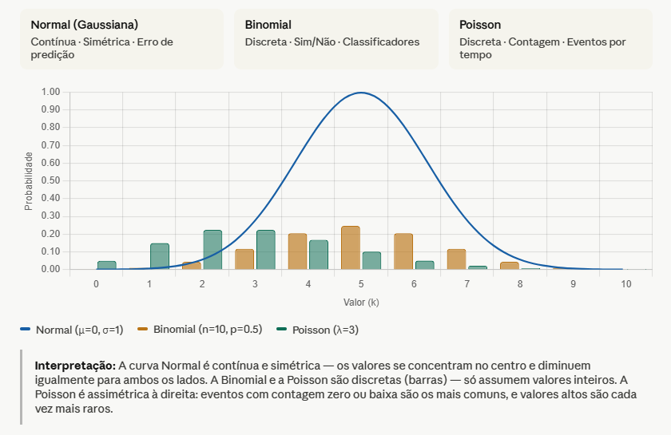

# Estatística aplicada para AIs

Fornece as técnicas para algoritmos identificarem padrões, como regressão linear, regressão logística e algoritmos de agrupamento.

*   **Medidas de Tendência Central:** Média, Mediana e Moda (Foco em: Tratamento de dados ausentes e preenchimento de lacunas).
*   **Medidas de Dispersão:** Variância e Desvio Padrão (Foco em: Entender o espalhamento dos dados e base para a Normalização).
*   **Análise de Correlação:** Coeficiente de Pearson (Foco em: Identificar quais variáveis realmente impactam o modelo e eliminar dados redundantes).
*   **Inferência Estatística e Amostragem:** População vs. Amostra (Foco em: Como o modelo generaliza o que aprendeu no treino para o mundo real).
*   **Distribuições de Probabilidade:** Distribuição Normal/Gaussiana e Softmax (Foco em: Inicialização de pesos e saída final de classificação).
*   **Métricas de Erro e Performance:** Erro Médio Quadrático (MSE), Erro Absoluto (MAE) e Acurácia (Foco em: Medir o sucesso do treinamento).

---

## Medidas de Tendência Central

### Média

É a soma de todos os valores pertencentes a um conjunto de dados dividida pela quantidade de elementos. Para as AIs, é uma ferramenta de equilíbrio.

**Aplicação:**

*   **Tratamento de Dados Faltantes:** Quando uma base de dados tem buracos, usamos a média do grupo para preencher esses vazios sem alterar o comportamento geral do conjunto.
*   **Normalização:** Para que um neurônio não dê importância excessiva a um número grande e ignore um pequeno, usamos a média para centralizar todos os dados em torno de zero.
*   **Fórmula:**

$$\bar{x} = \frac{\sum_{i=1}^{n} x_i}{n}$$

*   **$\bar{x}$:** Resultado final (Média).
*   **$\sum$:** Símbolo de somatório ("Some tudo o que vem depois").
*   **$x_i$:** Representa cada elemento individual da lista.
*   **$n$:** Quantidade total de itens.

---

### Mediana

A Mediana é o valor central que divide os dados ao meio. Na Engenharia de IA, funciona como um "filtro de ruído". É necessário ordenar os dados (**Rol**) antes do cálculo.

**Aplicação:**

*   **Resistência a Outliers:** Ignora valores extremos que distorceriam a média.
*   **Limpeza de Dados Sujos:** Estabiliza o treinamento ignorando falhas de sensores.

**Fórmula:**

1.  **Se $n$ for ímpar:** Posição central $= \frac{n + 1}{2}$
2.  **Se $n$ for par:** Média dos dois valores centrais:
    $$Md = \frac{x(\frac{n}{2}) + x(\frac{n}{2} + 1)}{2}$$

---

### Moda

É o valor que mais se repete em um conjunto de dados. Na IA, é a ferramenta para **Dados Categóricos** (textos, classes, etiquetas).

**Aplicação:**

*   **Imputação de Classes:** Preencher lacunas em colunas de texto com o valor mais frequente.
*   **Voto Majoritário (Ensemble Learning):** O resultado final escolhido é a moda das respostas de diferentes redes neurais.

---

## Medidas de Dispersão: Variância e Desvio Padrão

Se a Média diz onde os dados estão "amontoados", a Dispersão diz o quão espalhados eles estão.

### Variância

Mede a distância média de cada dado em relação à média do conjunto.

*   **Variância Populacional ($\sigma^2$):** Aplicada quando se tem o conjunto total de dados.
    $$\sigma^2 = \frac{\sum (x_i - \mu)^2}{n}$$

*   **Variância Amostral ($s^2$):** Aplicada quando os dados são apenas uma parte (amostra) de um todo maior.
    $$s^2 = \frac{\sum (x_i - \bar{x})^2}{n - 1}$$

### Desvio Padrão

É a "régua de erro" que indica o grau de dispersão em relação à média, expressa na mesma unidade dos dados originais.

**Fórmula (Amostral):**
$$s = \sqrt{\frac{\sum (x_i - \bar{x})^2}{n - 1}}$$

---

## Análise de Correlação: Coeficiente de Pearson ($r$)

Ferramenta que mede o grau de dependência entre duas variáveis, permitindo eliminar dados redundantes.

**Representação gráfica:**

**Fórmula:**
$$r = \frac{\sum (x_i - \bar{x})(y_i - \bar{y})}{\sqrt{\sum (x_i - \bar{x})^2 \cdot \sum (y_i - \bar{y})^2}}$$

---

## Inferência Estatística e Amostragem: População vs. Amostra

### Inferência Estatística

Processo de tirar conclusões sobre uma população inteira com base em uma amostra representativa. Em IA, permite que o modelo aprenda padrões e generalize para novos dados.

**Intervalo de Confiança (IC):**
$$IC = \bar{x} \pm z \cdot \frac{\sigma}{\sqrt{n}}$$

### Amostragem

Qualidade da seleção do subconjunto de dados. Uma amostragem ruim gera conclusões erradas, independentemente da sofisticação do modelo.

**Tamanho Amostral Mínimo ($n$):**
$$n = \frac{z^2 \cdot p \cdot (1-p)}{e^2}$$

---

## Distribuições de Probabilidade

### Distribuição Normal (Gaussiana)

Descreve fenômenos onde os valores se concentram em torno de uma média de forma simétrica. Essencial para a **Inicialização de Pesos** e **Normalização de Dados**.

**Fórmula:**
$$f(x) = \frac{1}{\sigma\sqrt{2\pi}} e^{-\frac{1}{2}\left(\frac{x-\mu}{\sigma}\right)^2}$$

---

### Distribuição Softmax

Função que converte um vetor de números brutos (*logits*) em uma distribuição de probabilidade. É a camada final de quase todos os modelos de classificação multiclasse.

**Fórmula:**
$$S(x_i) = \frac{e^{x_i}}{\sum_{j=1}^{n} e^{x_j}}$$

---

## Métricas de Erro e Performance

### Erro Absoluto (MAE)

Mede a média das diferenças absolutas entre o previsto e o real. É intuitivo e indica, em média, o quanto o modelo erra.

**Fórmula:**
$$MAE = \frac{1}{n} \sum_{i=1}^{n} |y_i - \hat{y}_i|$$

---

### Erro Médio Quadrático (MSE) e RMSE

*   **MSE:** Pune severamente erros grandes (eleva ao quadrado). É a métrica padrão para treinamento.
*   **RMSE:** Raiz do MSE, usada para interpretar o erro na escala original dos dados.

**Fórmulas:**
$$MSE = \frac{1}{n} \sum_{i=1}^{n} (y_i - \hat{y}_i)^2$$
$$RMSE = \sqrt{MSE}$$

---

### Acurácia

Mede a proporção de acertos totais sobre o total de exemplos.

**Fórmula:**
$$Acurácia = \frac{VP + VN}{VP + VN + FP + FN}$$

> **Nota:** Pode ser enganosa em dados desbalanceados (ex: detecção de fraudes).
